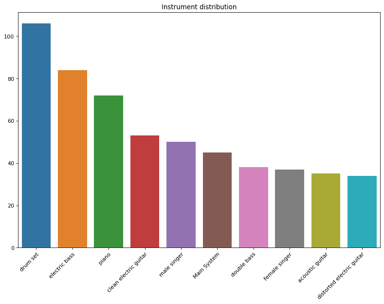
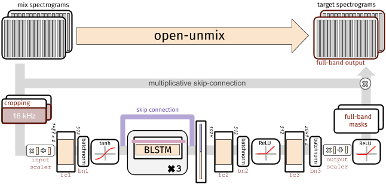
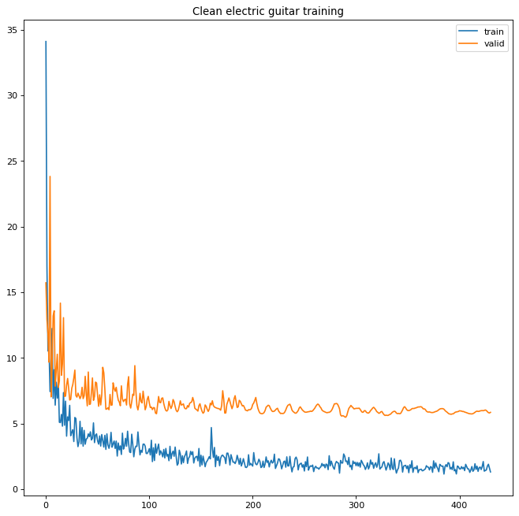
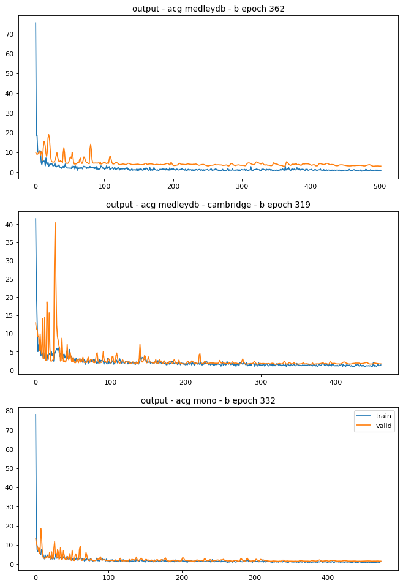

# Separating the guitar signal from the mix

## _Music Source Separation application using [Open-Unmix](https://github.com/sigsep/open-unmix-pytorch)_

[Mickaël Vitry](https://www.linkedin.com/in/micka%C3%ABl-vitry-b605489b/),
[Théo Rivaton](https://www.linkedin.com/in/th%C3%A9o-rivaton-890804123/)

Jedha Data Science Bootcamp - #dsmft-paris-08 - Fullstack final project

## Introduction

The music source separation is an active research domain and the data-driven methods in this field reaches state of the art performances. The Signal Separation Evalution Campaign (*[SiSec](https://sisec18.unmix.app/#/)*) compares the performance of source separation systems on the same data. The audio signals are those from the _vocals, bass and drums_.


In this project, our goal is to separate the _guitar_ signal from the mix.


## The MedleyDB dataset

The SiSec is based on the MUSDB dataset where the targets are vocals, bass and drums. We can't use this dataset since the guitar stems are not available.

The [MedleyDB](https://medleydb.weebly.com/) is a dataset of annotated, royalty-free multitrack recordings.

A total of 196 stereo tracks containing the mix, the processed stems, the raw audio and the metadata. The audio format is WAV (44100 Hz, 16 bit)

The `clean electric guitar` is **top 4** while the `acoustic guitar` is **top 9** in the instrument distribution:


30% of the tracks contains `clean electric guitar`, representing about 4 hours of music and about 20Go of data files.

## The Open-Unmix model (UMX)


This open source model operates in the time-frequency domain to perform its prediction. It is based on a three-layer bidirectional LSTM. From a random mix of predefined duration, the model learns to predict the magnitude spectrogram of the target from the input mix. The model makes his predictions by applying a full-band frequency mask. The optimization is done minimizing a mean squared error in the magnitude domain.

While this model was designed as a reference model for the SiSec, the MUSDB dataset is one of the five type of datasets we can use. To achieve our goal we choose the `VariableSourcesTrackFolderDataset`, since the tracks of MedleyDB have a variable number of sources.

## Requirements

The project was written in `python 3.7` and uses `pytorch 1.3.1` compiled for `CUDA`.

The audio files were processed using `wavfile` from `scipy.io` and the `librosa` library.

The preprocessing and the training was done on `Ubuntu 18.04`.

## Preprocessing

In order to use the UMX model, all the audio files of a track must have the same length. The model can be trained either in mono or stereo but you must choose the number of channels at the beginning and feed the model accordingly.

## Training

The spectrogram signature of the target instrument plays a decisive role in the model training performance. The less distinctive this signature is the more data you need for the model to learn how to separate the signal. 

The first attempt in the separation of the `clean electric guitar` wasn't convincing, the model failed to learn well:


The second attempt, we choose to separate the `acoustic guitar` from the mix. The audio signal of the `acoustic guitar` is more distinctive than the `clean electric guitar` signal. By design, this group of instrument is more homogeneous in the process of creating sounds. They usually don't have many effects applied on and the number of pickups used to capture the signal is far less than the ones used with the `clean electric guitar`. 

Even if we had less data (10Gb vs 20Gb), the results were better:


## Limitations

The choice of the target is limiting. Since the audio sources are rare we can't separate any instrument signal out of a track. The targeted audio signal should be at least distinctive from the others.

The number of instrument sharing the same frequency register in the mix should also be minimal.

## References
Open-unmix:
```
Fabian-Robert Stöter, Stefan Uhlich, Antoine Liutkus, Yuki Mitsufuji.
Open-Unmix - A Reference Implementation for Music Source Separation.
Journal of Open Source Software, Open Journals, 2019,
The Journal of Open Source Software, 4 (41), pp.1667.
⟨10.21105/joss.01667⟩. ⟨hal-02293689⟩
```

MedleyDB:
```
R. Bittner, J. Salamon, M. Tierney, M. Mauch, C. Cannam and J. P. Bello,
"MedleyDB: A Multitrack Dataset for Annotation-Intensive MIR Research",
in 15th International Society for Music Information Retrieval Conference,
Taipei, Taiwan, Oct. 2014.
```
